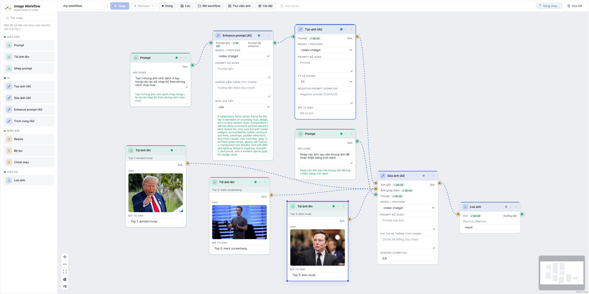
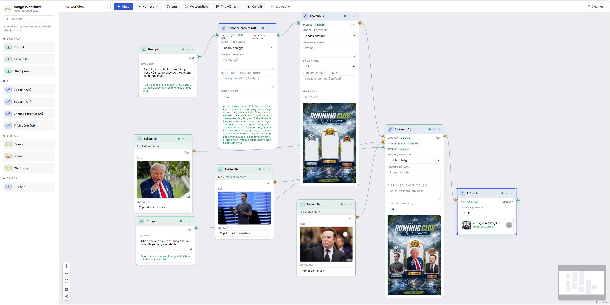

> **Tiếng Việt** · [English](README.md)

# Image Workflow

Công cụ AI tạo & sửa ảnh theo dạng **workflow kéo–thả node** (giống n8n): mỗi node là một
bước (prompt → tạo ảnh → sửa ảnh → biến đổi → lưu), nối dây giữa các node để dựng pipeline.



Chạy workflow → mỗi node hiện kết quả ngay trên canvas:



Ảnh kết quả cuối (ghép nhiều ảnh + prompt):


## Tính năng chính

- **Canvas kéo–thả:** dựng pipeline bằng cách nối các node, xem preview ảnh ngay trên node.
- **Đa provider AI:** `gemini` (Gemini 2.5 Flash Image), `openai` (gpt-image-1), `codex`
  (đăng nhập ChatGPT/OAuth, dùng quota gói ChatGPT). Mỗi provider chỉ cần khai báo API key
  trong **⚙ Cài đặt** (hoặc qua `.env`).
- **Cache theo node:** node không đổi sẽ dùng lại kết quả cũ (badge **⚡ cache**), không gọi
  lại AI → tiết kiệm token. Đổi param/đầu vào → chỉ node đó + downstream chạy lại.
- **Ghép nhiều ảnh:** ô **Mô tả ảnh** đặt tên từng ảnh và đi theo ảnh xuống node Sửa ảnh
  ("mặc áo ở Ảnh 1 lên người ở Ảnh 2").
- **Lưu workflow + lịch sử chạy** kiểu n8n (trạng thái, thời lượng, ảnh kết quả từng lần chạy).
- **Test offline:** provider `fake` vẽ ảnh placeholder, không gọi mạng, không tốn token.
- **Giao diện sáng/tối** (Hệ thống / Sáng / Tối), phong cách trung tính, phẳng.

## Cài đặt & chạy nhanh

Script bootstrap tự lo Python ≥3.10, Node ≥18, deps, build frontend rồi chạy app + mở trình duyệt.

```powershell
# Windows: double-click run.bat — hoặc:
powershell -ExecutionPolicy Bypass -File run.ps1
```

```bash
# Linux / macOS:
bash run.sh
```

Thêm `-Dev` / `--dev` để chạy dev mode, `-Rebuild` / `--rebuild` để build lại frontend.

### Cài thủ công

```powershell
# Backend
python -m venv backend\.venv
backend\.venv\Scripts\pip install -r backend\requirements.txt

# Frontend
npm install --prefix frontend

# API key
copy .env.example .env   # điền GEMINI_API_KEY / OPENAI_API_KEY (hoặc nhập sau trong ⚙ Cài đặt)
```

```powershell
# Terminal 1 — backend (cổng 8000). Dùng script này thay vì uvicorn CLI để giữ WS sống khi node AI chạy lâu.
backend\.venv\Scripts\python backend\run_server.py

# Terminal 2 — frontend (cổng 5173)
npm run dev --prefix frontend
```

Mở http://localhost:5173, kéo node từ thanh trái vào canvas, nối dây, bấm **▶ Chạy**.

## Đóng gói thành app desktop

Gói backend + frontend thành **1 app tự chứa** (máy đích không cần Python/Node):

```powershell
powershell -File build\build.ps1     # Windows → dist\ImageWorkflow\ImageWorkflow.exe
```
```bash
bash build/build.sh                  # macOS / Linux → dist/ImageWorkflow/ImageWorkflow
```

Double-click để chạy → tự bật server `127.0.0.1:8000` + mở trình duyệt. Dữ liệu
(`data.db`, `cache/`, `outputs/`...) tạo cạnh file thực thi.

**Release đa nền tảng:** đẩy tag (`git push origin v0.1.0`) → GitHub Actions build
Windows + macOS + Linux rồi đính file zip vào Release (`.github/workflows/release.yml`).

> **macOS — lần đầu chạy:** app chưa được Apple notarize nên macOS chặn với thông báo
> *"không thể kiểm tra phần mềm độc hại"* (hỏi từng file `.so`). File tải về bị gắn cờ
> *quarantine*. Cách nhanh nhất — **chuột phải `Run-ImageWorkflow.command` → Open → Open**
> (chỉ hỏi 1 lần): script tự gỡ quarantine cho toàn bộ bundle rồi mở app.
>
> Hoặc gỡ thủ công bằng Terminal rồi chạy:
>
> ```bash
> xattr -dr com.apple.quarantine ImageWorkflow   # thư mục giải nén từ zip
> ./ImageWorkflow/ImageWorkflow
> ```

## Các node có sẵn

| Node | Nhóm | Chức năng |
|---|---|---|
| Prompt | Đầu vào | Nhập text/prompt |
| Tải ảnh lên | Đầu vào | Upload ảnh + ô **Mô tả ảnh** (đi theo ảnh xuống node Sửa ảnh) |
| Ghép prompt | Đầu vào | Nối nhiều đoạn text thành một |
| Tạo ảnh (AI) | AI | Text → ảnh |
| Sửa ảnh (AI) | AI | Ảnh + prompt → ảnh đã sửa (đổi nền, thêm chi tiết, đổi style...) |
| Trích vùng (AI) | AI | Ảnh + mô tả đối tượng → AI tìm vùng → crop giữ pixel gốc |
| Resize | Biến đổi | Đổi kích thước |
| Bộ lọc | Biến đổi | Trắng đen / blur / sharpen... |
| Chỉnh màu | Biến đổi | Sáng / tương phản / bão hòa |
| Lưu ảnh | Đầu ra | Lưu vào `outputs/` |

## Ví dụ workflow

`Prompt("một chú mèo phi hành gia") → Tạo ảnh (gemini) → Sửa ảnh ("đổi nền thành sao Hỏa") → Resize → Lưu ảnh`

Workflow mẫu có sẵn trong `workflows/` — bấm **📂 Mở workflow** trên thanh công cụ để tải.

## Kiến trúc

- **Backend** (`backend/`): Python + FastAPI — engine thực thi workflow theo thứ tự topo,
  stream tiến độ qua WebSocket, cache kết quả từng node trên đĩa.
- **Frontend** (`frontend/`): React + React Flow — canvas kéo–thả, preview ảnh trên node.
- **Provider** (`backend/app/providers/`): cắm thêm bằng cách kế thừa `ImageProvider`,
  implement `generate()` + `edit()`, đăng ký trong `providers/__init__.py`.
- **Node mới** (`backend/app/nodes/`): kế thừa `BaseNode`, gắn `@register_node`, khai báo
  `inputs/outputs/params` — UI tự sinh form, không cần sửa frontend.

## Giấy phép

Phát hành theo [Apache License 2.0](LICENSE) — tự do dùng, sửa, phân phối (kèm cấp phép sáng chế).
